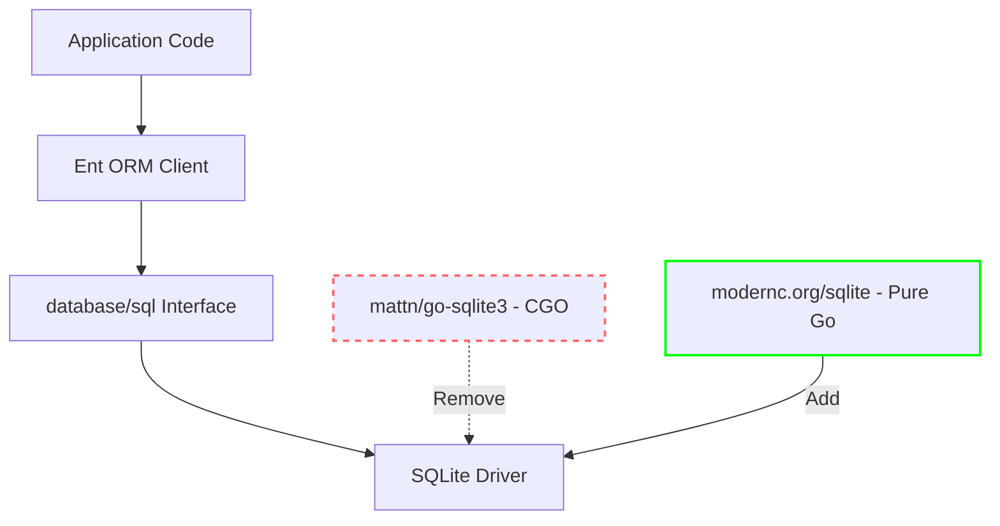

# Implementation Plan: Migrate from CGO SQLite to Pure Go SQLite

## Overview
The project currently uses `github.com/mattn/go-sqlite3` (CGO-based) in two modules:
- **backend**: Used with Ent ORM for data persistence
- **frontend/cli**: Used with Ent ORM for local CLI database

**Target**: Migrate to `modernc.org/sqlite` (pure Go, no CGO required)

## Architecture

The migration is straightforward since both libraries implement the `database/sql` driver interface. Ent ORM will work seamlessly with the new driver.

## File Changes

### Backend Module
- **backend/go.mod** - Replace sqlite3 dependency
- **backend/go.sum** - Update checksums (via go mod tidy)
- **backend/tool/base/testing.go** - Update import
- **backend/api/*_test.go** (7 files) - Update imports

### Frontend CLI Module  
- **frontend/cli/go.mod** - Replace sqlite3 dependency
- **frontend/cli/go.sum** - Update checksums (via go mod tidy)
- **frontend/cli/cmd/root.go** - Update import

### Driver Name
No changes needed - `dialect.SQLite` constant remains "sqlite3" for compatibility

## Implementation Steps

### 1. Update Backend Dependencies
- Remove `github.com/mattn/go-sqlite3` from backend/go.mod
- Add `modernc.org/sqlite` to backend/go.mod
- Run `go mod tidy` to update go.sum

### 2. Update Backend Imports
- Replace all `_ "github.com/mattn/go-sqlite3"` with `_ "modernc.org/sqlite"`
- Files: testing.go, handoff_test.go, agent_test.go, task_test.go, model_provider_test.go, message_test.go, model_test.go

### 3. Update Frontend CLI Dependencies
- Remove `github.com/mattn/go-sqlite3` from frontend/cli/go.mod
- Add `modernc.org/sqlite` to frontend/cli/go.mod
- Run `go mod tidy` to update go.sum

### 4. Update Frontend CLI Imports
- Replace `_ "github.com/mattn/go-sqlite3"` with `_ "modernc.org/sqlite"`
- File: frontend/cli/cmd/root.go

### 5. Test & Verify
- Run backend tests: `cd backend && go test ./...`
- Run CLI tests: `cd frontend/cli && go test ./...`
- Verify daemon startup with new driver
- Test database migrations

## Testing Strategy

1. **Unit Tests**: Existing test suite should pass without modification
2. **Integration Tests**: Verify database operations work correctly
3. **CLI Testing**: Test daemon startup and database initialization
4. **Migration Testing**: Verify existing SQLite databases open correctly

## Risks & Mitigations

⚠️ **Database Compatibility**: modernc.org/sqlite may have minor behavioral differences
- Mitigation: Run full test suite; DSN parameters remain compatible

⚠️ **Performance**: Pure Go implementation may have different performance characteristics
- Mitigation: For this use case (local development), performance should be adequate

⚠️ **Concurrent Access**: WAL mode behavior should be verified
- Mitigation: Existing `_journal=WAL` DSN parameter should work identically

## Key Benefits

✅ No CGO dependency - faster builds, easier cross-compilation
✅ Drop-in replacement - minimal code changes
✅ Better portability - works on any Go-supported platform
✅ Simpler build process - no C compiler required
